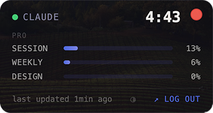
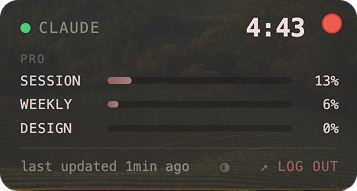
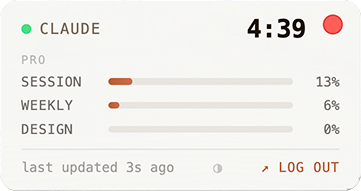

# Claude Bar

A transparent floating widget for macOS that tracks your Claude.ai usage limits in real-time.

| Dark | Mauve | Light |
|------|-------|-------|
|  |  |  |

## Features

- **Always on top** — borderless, semi-transparent widget that stays above all windows; click `⊤` to send it to the background, `⊥` to pin it back — choice persists across restarts
- **Real-time usage bars** — session, weekly, and per-model limits with color coding
- **Plan detection** — automatically reads your plan (Free, Pro, Max, Team, Enterprise) from the API
- **Smart colors** — green → yellow → blinking red as limits approach
- **3 color themes** — Dark, Light, and Mauve — click `◑` in the footer to cycle; choice persists across restarts
- **Resizable** — drag the bottom-right corner to scale the widget up or down proportionally
- **Session persistence** — logs in once, remembers your session across restarts
- **Auto-polling** — syncs data every 2 minutes

## Installation

Download the latest `.dmg` from the [Releases](https://github.com/vfxmajmuni/claude-bar/releases) tab, open it, and drag **Claude Bar** to Applications.

> First launch: right-click the app → **Open** to bypass the macOS Gatekeeper warning (ad-hoc signed build).

## Footer controls

| Button | Action |
|--------|--------|
| `◑` | Cycle color theme (Dark → Light → Mauve) |
| `⊤` / `⊥` | Toggle always-on-top. `⊤` = pinned above all windows; `⊥` = normal window (other windows can cover it) |
| `↗ log in` | Open login / log out |

## Themes

Click the `◑` button in the bottom footer to cycle through themes:

| Theme | Background | Accent |
|-------|-----------|--------|
| **Dark** | Deep navy `rgba(14,14,22)` | Indigo `#4f6ef7` |
| **Light** | Warm white `rgba(250,250,248)` | Claude coral `#cf6c45` |
| **Mauve** | Warm charcoal `#313030` | Dusty rose `#B08789` |

## How it works

Two Electron windows:

| Window | Role |
|--------|------|
| `floatWin` | Visible widget — transparent, always on top, 224×150px default |
| `scraperWin` | Hidden browser — authenticated Claude.ai session |

**Data flow:**

```
scraperWin preload
  → fetch /api/organizations        → org UUID + capabilities[] → plan name
  → fetch /api/organizations/{id}/usage → usage limits as JSON
  → ipcRenderer.send('usage:update', data)
  → ipcMain → floatWin.webContents.send('usage-update')
  → renderer.js → render()
```

**Plan detection** reads `org.capabilities[]` from the organizations API — the field that actually reflects the subscription (`claude_pro`, `claude_max`, etc.), not `rate_limit_tier` which is a technical rate-limit category.

**Cookie persistence** — cookies are saved manually to `{userData}/claude-cookies.json` after each successful fetch and restored on startup. No LevelDB / `persist:` partition used, which avoids lock conflicts on quick restarts.

## Color coding

| State | Condition |
|-------|-----------|
| 🔴 Critical (blinking) | < 15 min remaining or ≥ 90% used |
| 🟡 Warning | ≤ 45 min remaining or ≥ 70% used |
| 🟢 OK | everything else |

## Development

```bash
npm install
npm start
```

Build DMG:

```bash
npm run dist
```

## Architecture notes

- Polling interval: **2 minutes** (in `preload-scraper.js`)
- Scraper session: **in-memory partition** (`scraper-temp`, no `persist:` prefix) — avoids LevelDB lock errors on rapid restarts
- Usage bars are rendered dynamically from any JSON field with a `utilization` number — new Claude model limits appear automatically without code changes
- Resize: dragging the corner updates `body.style.zoom` synchronously on every `mousemove` before the IPC call completes, so content and window frame scale together without lag
- Themes: CSS custom properties on `:root` + `html[data-theme]` overrides in `style.css`; flash-free loading via inline `<script>` in `<head>` that reads `localStorage` before first paint
