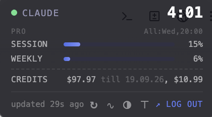
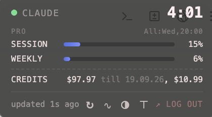
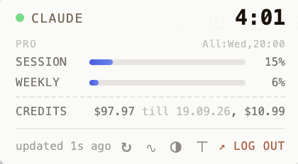
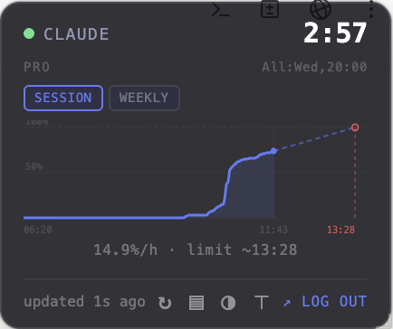
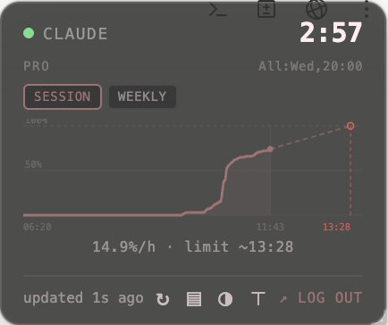
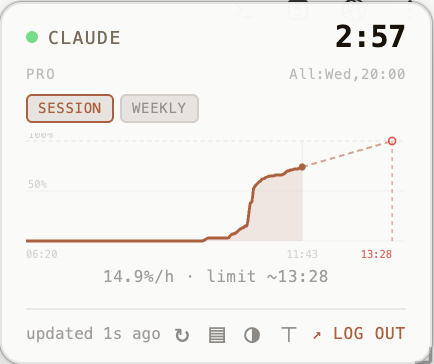

# Claude Bar

A transparent floating widget for macOS that tracks your Claude.ai usage limits in real-time.

| Dark | Mauve | Light |
|------|-------|-------|
|  |  |  |

**Usage History** — click `∿` to see a sparkline of the last 48 h with burn rate and limit forecast:

| Dark | Mauve | Light |
|------|-------|-------|
|  |  |  |

## Features

- **Usage history & sparkline** — click `∿` to see a 48 h sparkline per limit (SESSION / WEEKLY / EXTRA_US) with burn rate (`78.7%/h`), a forecast line, and a red marker at the projected limit time
- **Usage % in the menubar** — the tray icon shows the Session limit percentage right next to it, so you don't even need the widget on screen
- **Threshold notifications** — system notification when any limit crosses 80% / 95%, and when the session resets (both toggleable in the tray menu)
- **Always on top** — borderless, semi-transparent widget that stays above all windows; click `⊤` to send it to the background, `⊥` to pin it back — choice persists across restarts
- **Real-time usage bars** — session, weekly, and per-model limits with color coding
- **Plan detection** — automatically reads your plan (Free, Pro, Max, Team, Enterprise) from the API
- **Smart colors** — blue → yellow → red as limits fill up (0–34% / 35–79% / 80–100%)
- **3 color themes** — Dark, Light, and Mauve — click `◑` in the footer to cycle; choice persists across restarts
- **Resizable** — drag the bottom-right corner to scale the widget; height adapts to the number of bars
- **Session persistence** — logs in once, remembers your session across restarts (cookies encrypted via macOS Keychain)
- **Auto-polling** — syncs every 2 minutes by default; configurable (1/2/5/10 min) in the tray menu, plus a manual `↻` refresh button
- **Launch at Login** — toggleable in the tray menu
- **Auto-update** — silent daily check shows an install banner in the widget; manual _Check for Updates…_ in the tray menu

## Installation

Download the latest `.dmg` from the [Releases](https://github.com/alexivakhov/claude-bar/releases) tab, open it, and drag **Claude Bar** to Applications.

> First launch: right-click the app → **Open** to bypass the macOS Gatekeeper warning (ad-hoc signed build).

### Requirements

| | |
|---|---|
| **OS** | macOS 12 Monterey or later |
| **Arch** | Apple Silicon (arm64) or Intel (x64) |

## Footer controls

| Button | Action |
|--------|--------|
| `↻` | Refresh usage data now |
| `∿` | Toggle Usage History screen (sparkline + burn rate) |
| `◑` | Cycle color theme (Dark → Light → Mauve) |
| `⊤` / `⊥` | Toggle always-on-top. `⊤` = pinned above all windows; `⊥` = normal window (other windows can cover it) |
| `↗ log in` / `↗ log out` | Open login or log out |

## Tray menu

Left-click the tray icon to show/hide the widget. Right-click to access:

| Item | Action |
|------|--------|
| Show / Hide | Toggle widget visibility |
| Log in… | Re-authenticate with Claude.ai |
| Refresh Interval | Poll every 1 / 2 / 5 / 10 minutes (persisted) |
| Notify at 80% / 95% | Toggle threshold notifications |
| Notify on Session Reset | Toggle "you can work again" notification |
| Launch at Login | Start Claude Bar automatically on login |
| Check for Updates… | Download and install the latest release automatically |
| Quit | Exit the app |

## Themes

Click the `◑` button in the bottom footer to cycle through themes:

| Theme | Background | Accent |
|-------|-----------|--------|
| **Dark** | Deep navy `rgba(14,14,22)` | Indigo `#4f6ef7` |
| **Light** | Warm white `rgba(250,250,248)` | Claude coral `#cf6c45` |
| **Mauve** | Warm charcoal `#313030` | Dusty rose `#B08789` |

## How it works

Two Electron windows:

| Window | Role |
|--------|------|
| `floatWin` | Visible widget — transparent, always on top, 224×150px default |
| `scraperWin` | Hidden browser — authenticated Claude.ai session |

**Data flow:**

```
preload-scraper.js poll() [every 2 minutes]
  → fetch /api/organizations              → org UUID + capabilities[] → plan name
  → fetch /api/organizations/{id}/usage   → usage limits as JSON
  → ipcRenderer.send('usage:update', data)
  → ipcMain → floatWin.webContents.send('usage-update')
  → renderer.js → render()
```

**Plan detection** reads `org.capabilities[]` from the organizations API — the field that actually reflects the subscription (`claude_pro`, `claude_max`, etc.), not `rate_limit_tier` which is a technical rate-limit category.

**Session countdown** — the timer in the widget is updated every 30 seconds locally from the `resetsAt` timestamp received at poll time, so it counts down smoothly between 2-minute polls.

**Cookie persistence** — cookies are saved to `{userData}/claude-cookies.json`, encrypted via Electron's `safeStorage` (OS keychain-backed). No LevelDB / `persist:` partition used, which avoids lock conflicts on quick restarts.

## Color coding

### Progress bars

| Color | Usage |
|-------|-------|
| 🔵 Blue | 0–34% |
| 🟡 Yellow | 35–79% |
| 🔴 Red | 80–100% |

### Timer & dot

| State | Condition |
|-------|-----------|
| 🔴 Critical (blinking) | < 15 min remaining |
| 🟡 Warning | ≤ 45 min remaining |
| 🟢 OK | everything else |

## Development

```bash
git clone https://github.com/alexivakhov/claude-bar.git
cd claude-bar
npm install
npm start
```

Build DMG (Apple Silicon):

```bash
npm run dist -- --arm64
```

## Architecture notes

- Polling interval: **2 minutes** by default, user-configurable via the tray menu (persisted to `{userData}/settings.json`); timer display refreshes locally every **30 seconds** from the `resetsAt` absolute timestamp
- Update checks: silent daily check against GitHub Releases shows an in-widget banner; the menubar `%` is the max utilization across all bars
- Scraper session: **in-memory partition** (`scraper-temp`, no `persist:` prefix) — avoids LevelDB lock errors on rapid restarts
- Usage bars are rendered dynamically from any JSON field with a `utilization` number — new Claude model limits appear automatically without code changes
- Resize: dragging the corner updates `body.style.zoom` synchronously on every `mousemove` before the IPC call completes, so content and window frame scale together without lag
- Themes: CSS custom properties on `:root` + `html[data-theme]` overrides in `style.css`; flash-free loading via inline `<script>` in `<head>` that reads `localStorage` before first paint
- Dock icon: `LSUIElement = true` in `Info.plist` (set via `afterPack` hook) + `app.dock.hide()` at startup. All `dialog.showMessageBox()` calls pass `floatWin` as parent to prevent macOS from re-showing the Dock icon internally

## Credits

Based on [vfxmajmuni/claude-bar](https://github.com/vfxmajmuni/claude-bar) by [@vfxmajmuni](https://github.com/vfxmajmuni).
